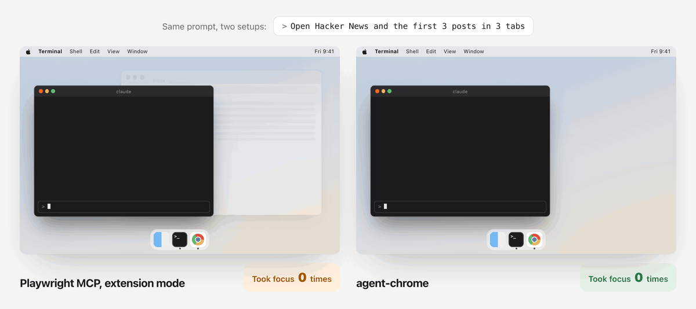
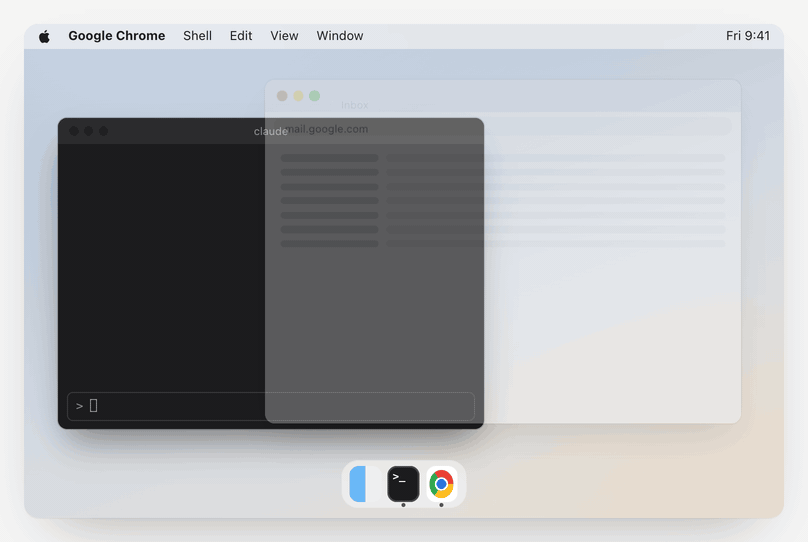
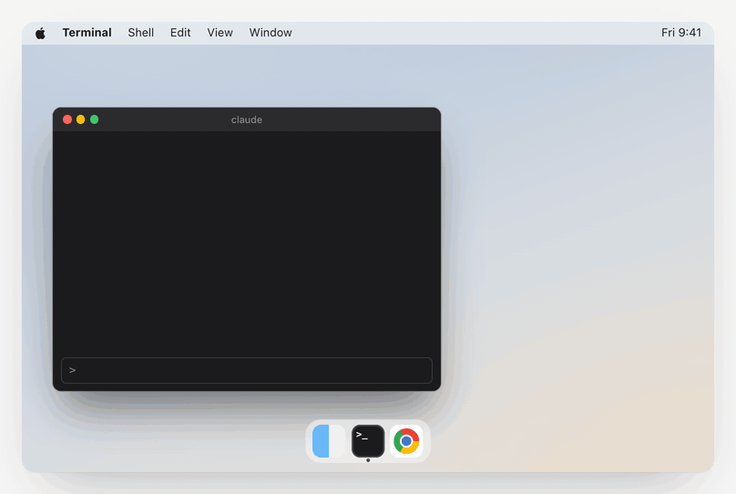
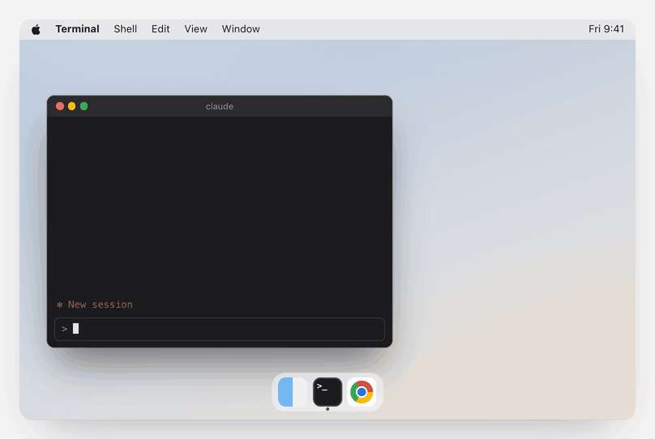
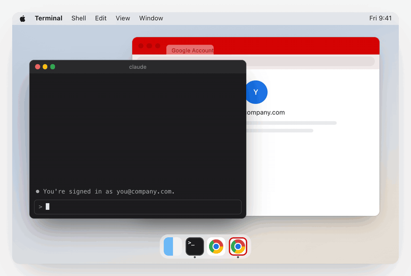
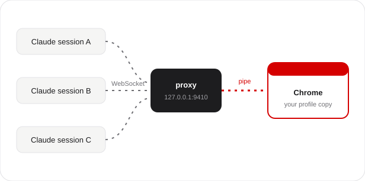

<div align="center">


# agent-chrome

### Your Chrome, behind the terminal.

agent-chrome lets Claude Code use a copy of your signed-in Chrome. The window opens behind your other apps, so you keep typing while Claude browses as you.

[**Website**](https://agentchrome.hardeep.cv) &nbsp;&nbsp; [Install](#set-it-up-in-five-steps) &nbsp;&nbsp; [How it works](#why-the-window-stays-behind) &nbsp;&nbsp; [Watch the 1:26 video](https://agentchrome.hardeep.cv/demo.mp4)

<br>



**Same prompt, two setups.** Playwright MCP pulls Chrome to the front on every call, and what you type next lands in the browser.<br>agent-chrome opens the tabs in a red window behind your terminal. Focus stays where you left it.

</div>

```
/plugin marketplace add rav4nn/agent-chrome
```

Free and open source. Needs macOS, Google Chrome, Node 18.3 or later, and Claude Code.

## How it compares

Headless Playwright never takes focus, but you can't see what it's doing. The other tools show you a window, then pull it in front of your work. agent-chrome gives you a window you can watch, and keeps it behind your terminal.

| | **agent-chrome** | Playwright MCP<br><sub>headless</sub> | Playwright MCP<br><sub>extension mode</sub> | Chrome DevTools MCP<br><sub>default setup</sub> |
| --- | :---: | :---: | :---: | :---: |
| **You can watch it work**<br><sub>Open the window any time and see what Claude is doing, then fix your prompt or skill.</sub> | ✅ | ❌ | ✅ | ✅ |
| **You can take over a login**<br><sub>When Claude stops at a sign-in, a 2FA code or a CAPTCHA, click in and finish it.</sub> | ✅ | ❌ | ✅ | ✅ |
| **You keep typing**<br><sub>The browser never jumps in front of your terminal.</sub> | ✅ | ✅ | ❌ | ❌ |
| **Uses your Chrome sign-ins**<br><sub>The accounts you already use in Chrome are there on the first run.</sub> | ✅ | ❌ | ✅ | ❌<br><sub>separate profile</sub> |
| **Looks like a normal browser**<br><sub>Some sites, like X and LinkedIn, flag headless and automated browsers.</sub> | ✅ | ➖<br><sub>often flagged</sub> | ✅ | ➖<br><sub>automation flag on</sub> |
| **Sessions share one browser**<br><sub>Several Claude Code sessions use the same signed-in window at once.</sub> | ✅ | ❌<br><sub>profile lock</sub> | ✅ | ❌<br><sub>profile lock</sub> |

✅ yes &nbsp; ➖ partly &nbsp; ❌ no. Default setups on macOS, checked October 2026. Chrome DevTools MCP can attach to your own Chrome with `--autoConnect`.

## Set it up in five steps

About two minutes.

### 1. Quit Chrome

Press <kbd>⌘</kbd> <kbd>Q</kbd> in Chrome. Closing the window isn't enough.

agent-chrome copies your Chrome profile. If Chrome is running, the copy can lose its sign-ins.



### 2. Add the plugin

In Claude Code, run these two commands:

```
/plugin marketplace add rav4nn/agent-chrome
```

```
/plugin install agent-chrome@agent-chrome
```

The plugin teaches Claude how to set up and use agent-chrome. It doesn't give Claude a browser yet. Step 3 does.


<details>
<summary><b>Rather not use the plugin?</b></summary>

<br>

Run the setup CLI with npx. No clone needed:

```bash
npx github:rav4nn/agent-chrome profiles
npx github:rav4nn/agent-chrome add "Work"
```

Or clone the repo:

```bash
git clone https://github.com/rav4nn/agent-chrome.git
cd agent-chrome
node bin/agent-chrome.mjs profiles
node bin/agent-chrome.mjs add "Work"
```

Then go on with step 4.

</details>

### 3. Set up a profile

Ask Claude:

```
Set up agent-chrome for one of my Chrome profiles.
```

Claude lists your Chrome profiles and asks which one you want. Pick one, say **Work**.

macOS then tells you that `agent-chrome-work` can run in the background. That's the small proxy for this profile. It uses about 25 MB of memory while it waits.



### 4. Start a new session and test it

Start a new Claude Code session (or resume one) so the new `chrome-work` tools load. Then ask:

```
Open chrome-work and go to myaccount.google.com. Tell me which Google account is signed in. Don't click or change anything.
```

Keep typing while it runs. The agent window has a red theme and opens behind your terminal.



### 5. Quit it, then ask again

When Claude is done, quit the red Chrome from the Dock. Then ask:

```
Open chrome-work and go to example.com.
```

The window comes back behind your apps, still signed in. Only you ever close it.



## Name the profile in every prompt

Each profile you add becomes its own MCP server, `chrome-<name>`. Say the name and Claude uses that profile, with whatever accounts it's signed in to. Without a name, Claude asks which one you mean.

```
Open chrome-work and go to reddit.com. Open the first 3 posts and summarise them.
```

```
Open chrome-work and check my GitHub notifications. List the ones that need a reply.
```

```
Open chrome-personal and find the tracking link for my last Amazon order.
```

## Why the window stays behind



On macOS, Chrome jumps to the front each time a tool talks to it over its debug port ([chrome-devtools-mcp#1254](https://github.com/ChromeDevTools/chrome-devtools-mcp/issues/1254)). The WebSocket transport activates Chrome.app, and no `bringToFront: false` setting helps. A pipe (`--remote-debugging-pipe`) doesn't trigger that, but only the program that launched Chrome can hold the pipe. So two Claude sessions either fight over the profile lock or each start a throwaway Chrome, and you sign in again every session.

agent-chrome runs a small proxy for each profile. The proxy holds the pipe to Chrome, and every Claude session connects to the proxy. Several sessions share one signed-in Chrome, and none of them steals focus.

About 500 lines of Node.js. One dependency (`ws`). Localhost only. No telemetry. MIT.

<details>
<summary><b>How the multiplexing works</b></summary>

<br>

The proxy launches Chrome with `--remote-debugging-pipe`, which gives a JSON-over-stdio CDP channel to the launching process only. It then serves a localhost HTTP and WebSocket interface in the same format as Chrome's `--remote-debugging-port` discovery (`/json/version`, `/json/list`, a browser-level WebSocket). `chrome-devtools-mcp --browserUrl http://127.0.0.1:9410` connects without knowing it isn't talking to Chrome.

Three patterns let many MCP clients share one pipe:

- **Request-ID remapping.** Each client numbers its requests `1, 2, 3, ...` on its own, and those ids would collide on the pipe. The proxy rewrites every incoming `id` to a unique proxy id, records `proxyId → {client, originalId, method}`, forwards to Chrome, and restores the original id on the response.
- **Cached target state.** The proxy turns on target discovery and auto-attach itself and caches every target and session. When a client asks for discovery or auto-attach, the proxy replays the cache to that client instead of forwarding the call.
- **Shared sessions.** Chrome's events go to every client. Clients ignore events for sessions they don't track.

```
[Claude session A] chrome-devtools-mcp ─┐
[Claude session B] chrome-devtools-mcp ─┼── WebSocket(127.0.0.1:9410) ── proxy ── stdio pipe ── [Chrome, profile copy]
[Claude session C] chrome-devtools-mcp ─┘
```

</details>

## Good to know

<details>
<summary><b>Why not run Playwright headless?</b></summary>

<br>

You can't see a headless browser. With agent-chrome you can open the red window any time, watch what Claude does, and fix your prompt or skill when it goes wrong. If it stops at a login, a 2FA code or a CAPTCHA, you click in and finish that step yourself. Playwright also uses its own profile, so your Chrome sign-ins aren't there, and you can't sign in to a window you can't see. agent-chrome uses a copy of your real, signed-in Chrome.

</details>

<details>
<summary><b>Can websites tell that Claude is driving the browser?</b></summary>

<br>

Sometimes. agent-chrome starts Chrome with `--disable-blink-features=AutomationControlled`, so `navigator.webdriver` is false and the cheapest check fails. But a site can still spot the attached debugger, and it can watch how the page gets used: clicks with no mouse movement, text that appears all at once, actions faster than a person. Your real profile, with its history and cookies, helps a lot. It doesn't make Claude invisible.

</details>

<details>
<summary><b>Can I use stealth Chrome instead?</b></summary>

<br>

For hiding automation, stealth builds like Patchright go further than agent-chrome. They hide debugger traces that agent-chrome doesn't. But they don't fix focus or sharing. The tool that launches the browser owns it. Over a pipe, only that one Claude session can drive it, and a second session hits the profile lock. Over a debug port, several sessions can connect, but that's the path that pulls Chrome to the front on macOS. agent-chrome's proxy holds the pipe and lets every session share it. And point stealth at real Chrome, not Chromium: Chromium can't read the cookies in a copied Chrome profile, so you'd start signed out.

</details>

<details>
<summary><b>What about computer use?</b></summary>

<br>

Computer use moves your real mouse and types with your keyboard, so you can't work while it runs. It reads a screenshot at every step, which makes it slow, and one screen means one agent at a time. agent-chrome works in a window behind yours, and you keep your keyboard.

</details>

<details>
<summary><b>Does Claude use my real Chrome profile?</b></summary>

<br>

No. It uses a copy. Chrome refuses remote debugging on its default data folder (`DevTools remote debugging requires a non-default data directory.`), so agent-chrome copies the profile instead of using it in place. This is separate from the Chrome 136+ port restriction. On APFS the copy takes no extra disk space until the two drift apart. Your own Chrome stays yours.

</details>

<details>
<summary><b>I signed in to a site in my own Chrome. Why is the agent window signed out?</b></summary>

<br>

The copy doesn't pick up new sign-ins. Sign in inside the red window once, or quit Chrome and run `add "Work" --recopy` for a fresh copy.

</details>

<details>
<summary><b>How much memory does it use?</b></summary>

<br>

The proxy uses about 25 MB while it waits, and no CPU. An open agent window is a separate, full Chrome: about 500 MB for one simple page. Heavy sites and long uptime add more: one with Gmail open for a day measured 1.6 GB. Quit the window to free it.

</details>

<details>
<summary><b>What syncs back to my Google account?</b></summary>

<br>

`add` turns off sync in the copy for themes, typed URLs, tabs, tab groups, extensions and apps. The copy is its own sync device. Passwords, bookmarks, autofill and settings still sync, so a password or bookmark that the agent saves reaches your real Google account.

</details>

<details>
<summary><b>Does my password manager work in the agent window?</b></summary>

<br>

No. Extensions are off there. Sign in by hand once, or let Chrome's own password manager fill the form.

</details>

<details>
<summary><b>Can two Claude sessions use the same profile?</b></summary>

<br>

Yes. They share one agent window, and every session can see and drive every tab in it. The proxy doesn't enforce tab ownership. The plugin's skill tells each Claude session to work only in the tabs it opened, which keeps sessions out of each other's way, but it's a convention, not a security boundary. Two sessions that enable Runtime on the same tab at the same moment can race.

</details>

<details>
<summary><b>Can a website connect to the proxy?</b></summary>

<br>

No. Whoever connects controls a signed-in browser, so the proxy refuses any request with an `Origin` header (browsers send one, so a web page can't connect to `127.0.0.1`) and any `Host` other than `127.0.0.1`, `localhost` or `[::1]` (DNS rebinding). Other programs on your Mac can still connect, the same as with Chrome's own debug port.

</details>

<details>
<summary><b>Can I use Playwright through the proxy?</b></summary>

<br>

No. Playwright's `connectOverCDP` doesn't work through the proxy. Use chrome-devtools-mcp, which the setup registers for you.

</details>

<details>
<summary><b>Windows or Linux?</b></summary>

<br>

Not yet. The focus bug is a macOS problem, and the setup CLI is macOS only. The pipe multiplexer itself would work there.

</details>

<details>
<summary><b>How do I remove it?</b></summary>

<br>

Ask Claude to remove agent-chrome for chrome-work, or run `npx github:rav4nn/agent-chrome remove work`. It stops the proxy, removes the login item and unregisters the MCP server. Add `--delete-profile` to delete the copy too.

</details>

## Reference

### Commands

| Command | What it does |
| --- | --- |
| `profiles` | Lists your Chrome profiles (folder, name, email) and the slug of each one you've set up |
| `add <profile>` | Sets up a profile. `<profile>` is its folder (`"Profile 5"`), display name or email |
| `remove <slug>` | Stops the proxy, deletes its LaunchAgent and unregisters the MCP server. Keeps the copy |
| `status` | One row per installed slug: port, proxy up, agent window open, MCP server registered |
| `update` | Refreshes the proxy code in the runtime folder and restarts every proxy |

Options for `add`:

| Option | Default | Meaning |
| --- | --- | --- |
| `--name <slug>` | the profile's name, lowercased, with hyphens | MCP server is `chrome-<slug>` |
| `--port <n>` | first free port from 9410 | Proxy port |
| `--color <#rrggbb>` | `#D50000` | Theme colour of the agent window |
| `--recopy` | off | Replace an existing copy with a fresh one from your real profile |
| `--force` | off | Copy while Chrome is running. Live databases may copy in a mixed state, and the copy can lose sign-ins |
| `--dry-run` | off | Print the plan, change nothing |

`remove` takes `--delete-profile` to delete the copy too, and `--dry-run`. `update` takes `--dry-run`.

Running `add` again for the same profile is safe. It keeps the existing copy and port, and rewrites the theme, LaunchAgent and MCP server.

### What `add` does

1. Copies the profile into `~/Library/Application Support/agent-chrome/profiles/<slug>/`. It uses an APFS clone, so the copy is fast and takes no extra disk space until the two drift apart.
2. Gives the copy a coloured theme (default `#D50000`), so you can tell the agent window from yours.
3. Turns off sync in the copy for themes, typed URLs, tabs, tab groups, extensions and apps. Synced themes would push the agent colour back into your real profile, and agent history would land in it.
4. Installs the proxy in `~/Library/Application Support/agent-chrome/runtime/` and a LaunchAgent, `io.github.rav4nn.agent-chrome.<slug>`, that starts it at login through a small launcher, `launchers/agent-chrome-<slug>`. Logs go to `~/Library/Logs/agent-chrome/<slug>.log`. Activity Monitor lists the proxy as `node`. You can turn the login item off in System Settings > General > Login Items & Extensions, but then Claude can't open that profile.
5. Registers a user-scope MCP server, `chrome-<slug>`: chrome-devtools-mcp pointed at the proxy's port. It uses your global `chrome-devtools-mcp` if you have one, and `npx chrome-devtools-mcp@latest` if not. Without the `claude` CLI on your PATH, it prints the JSON to paste into `~/.claude.json`.

Add `--dry-run` to see every file write and command without running any of them.

### Using it from Claude

- The tools are `mcp__chrome-<slug>__*`, from chrome-devtools-mcp.
- Open pages with `new_page` and `background: true`. The first new tab starts Chrome.
- Each session works only in the tabs it opened. That's a rule in the plugin's skill, not something the proxy enforces: all sessions share one window and can see and drive every tab in it.
- Only you close the agent window. After you quit it, the tools report no pages. The next `new_page` opens it again.
- When the last agent tab closes (Quit, the window's close button, or the last tab), the proxy exits that Chrome, so no empty Chrome stays in the Dock.
- If a site shows you signed out, sign in inside the agent window.

The plugin's skill tells Claude all of this.

### Running the proxy by hand

The CLI covers the usual setup. To run the proxy yourself:

```bash
npm install --omit=dev
node pipe-cdp-proxy.mjs --port 9410 \
  --user-data-dir "$HOME/Library/Application Support/Chrome-Pipe-Proxy" \
  --profile-directory Default
```

| Flag | Default | Description |
| --- | --- | --- |
| `--port` | `9410` | Port the proxy listens on for MCP clients |
| `--chrome-path` | `/Applications/Google Chrome.app/Contents/MacOS/Google Chrome` | Chrome binary |
| `--user-data-dir` | `$HOME/Library/Application Support/Chrome-Pipe-Proxy` | Chrome data folder. Must not be Chrome's default |
| `--profile-directory` | `Default` | Profile folder inside `--user-data-dir` |

Health check:

```bash
curl -s http://127.0.0.1:9410/proxy/status
```

It returns `chromeRunning`, `chromePid`, `clients` and cache counts. Set `PROXY_DEBUG=1` to log every CDP message.

### Tests

```bash
npm test                          # CLI unit tests, and the proxy's local-tools-only guard
node test/live-check.mjs <port>   # drives a real Chrome through a running proxy with its window closed
```

The live check loads Puppeteer from a global `chrome-devtools-mcp` install.

## Changes from upstream

agent-chrome is a fork of [mimkorn/chrome-pipe-proxy](https://github.com/mimkorn/chrome-pipe-proxy). The proxy is the same idea. This fork adds a setup CLI, a Claude Code plugin and these proxy changes:

- `--profile-directory` picks the Chrome profile inside `--user-data-dir`.
- Chrome starts only when a client opens a tab or browser context. A connect, a discovery call or a page list while Chrome is down gets an empty browser, not a launch.
- No auto-restart. When you quit Chrome, the proxy drops its clients, and a reconnect doesn't bring the window back.
- New tabs open in the background. The proxy opens a new window only when none exists, and answers `Page.bringToFront` itself. Both used to raise the window on macOS, even over the pipe.
- The proxy sends `Runtime.disable` before a client's `Runtime.enable` on a shared tab, so a later session can take over a tab an earlier one left open.
- Each client's messages keep their order across the launch wait, and a malformed message no longer stops the queue.
- Chrome launches with no extensions, no startup window and no throttling of a window that sits behind other apps.
- Local tools only: the `Origin` and `Host` guard described in [Good to know](#good-to-know). Upstream accepted both.
- The setup CLI, the Claude Code plugin and skill, and tests are new.

## Credits

The proxy comes from [mimkorn/chrome-pipe-proxy](https://github.com/mimkorn/chrome-pipe-proxy) by Simon Democko. Its multi-client routing (request-ID remapping, session ownership) follows [henu-wang/chrome-mcp-proxy](https://github.com/henu-wang/chrome-mcp-proxy), which solves a different shape of the same problem with a WebSocket-to-WebSocket filter proxy.

## License

MIT. See [LICENSE](LICENSE).
